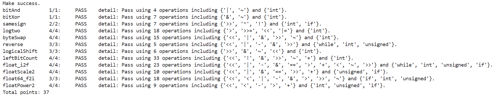

# datalab 报告

姓名：陈鹤天

学号：2025201695

总分：**37 / 37**

| 整数题          | 得分    | 操作数 / 上限 |
| ------------ | ----- | -------- |
| bitAnd       | 1 / 1 | 4 / 7    |
| bitXor       | 1 / 1 | 7 / 7    |
| samesign     | 2 / 2 | 7 / 12   |
| logtwo       | 4 / 4 | 18 / 25  |
| byteSwap     | 4 / 4 | 15 / 17  |
| reverse      | 3 / 3 | 5 / 30   |
| logicalShift | 3 / 3 | 6 / 20   |
| leftBitCount | 4 / 4 | 33 / 50  |

| 浮点题          | 得分    | 操作数 / 上限 |
| ------------ | ----- | -------- |
| float\_i2f   | 4 / 4 | 23 / 30  |
| floatScale2  | 4 / 4 | 10 / 30  |
| float64\_f2i | 3 / 3 | 18 / 60  |
| floatPower2  | 4 / 4 | 9 / 30   |

test 截图：



<!-- TODO: 在 Linux 上执行 make && python3 test.py -V，把输出截图保存为 report/imgs/test.png -->

## 解题报告

### 亮点

1. **float\_i2f** —— 三部分（取绝对值、规格化、舍入）都写全了，包括最容易漏的"就近舍入到偶"和 `INT_MIN` 取绝对值时的溢出。
2. **leftBitCount** —— 先把它化成"数 `~x` 的前导 0"，再二分定位，33 个操作完成，两个边界（全 1 得 32、正数得 0）都单独处理了。
3. **floatPower2** —— 完全不用浮点运算，直接由指数域拼出结果，9 个操作。
4. **logicalShift / reverse / bitAnd** —— 分别是 6、5、4 个操作，基本是一行或一个循环解决。

### bitAnd

```c
return ~(~x | ~y);
```

只给 `~` 和 `|`，那就是 De Morgan 律反过来用：`x & y = ~(~x | ~y)`。（4 / 7）

### bitXor

```c
int a = ~(x & y);
int b = ~(~x & ~y);
return a & b;
```

异或的含义是"至少有一个 1，但不同时为 1"，也就是 `x ^ y = (x | y) & ~(x & y)`。这里没有 `|`，把 `x | y` 换成 `~(~x & ~y)` 代进去即可。正好用满 7 个操作，拆成两个临时变量只是为了不漏括号。（7 / 7）

### samesign

```c
int a = !x;
int b = !y;
if (a ^ b) {
    return 0;
}
return !((x >> 31) ^ (y >> 31));
```

题目规定 0 既不正也不负，所以要单独排除"一个为 0、另一个不为 0"：`a`、`b` 分别表示 x、y 是否为 0，`a ^ b` 为 1 就说明只有一个为 0，直接返回 0。剩下的情况只要符号位相同就算同号，`x >> 31` 取出符号位（负数是全 1、非负是 0），异或后取反。（7 / 12）

### logtwo

```c
int t = (v > 0xFFFF) << 4;   /* t 是 0 或 16 */
r |= t;
v >>= t;
```

这题不允许用 if/while，所以只能让比较表达式先产生 0/1，再左移成所需的权重。思路是二分：先看最高位是不是在第 16 位以上，是就把答案加上 16 并把 v 右移 16 位（等于丢掉已经确定的那一半），再用 `(v > 0xFF) << 3`、`(v > 0xF) << 2`、`(v > 0x3) << 1` 重复同样的三步，最后 `r |= (v > 0x1)`。（18 / 25）

### byteSwap

```c
int a = (x >> sn) & 0xFF;                  /* 第 n 个字节 */
int b = (x >> sm) & 0xFF;                  /* 第 m 个字节 */
int mask = ~((0xFF << sn) | (0xFF << sm)); /* 这两个字节位置清零 */
x = x & mask;
x = x | (b << sn);
x = x | (a << sm);
return x;
```

先把要交换的两个字节取出来（`sn = n << 3`，用左移 3 位代替乘 8），构造掩码把这两个字节清零，再把取出的字节按对方的位置写回去。n 和 m 相等时，清掉某个字节后又写回同一个值，结果和原数一致，不需要特判。（15 / 17）

### reverse

```c
while (i) {
    r = (r << 1) | (v & 1);
    v = v >> 1;
    i = i - 1;
}
```

这题允许使用 for/while，就直接循环 32 次：每轮把结果左移一位，末尾接上 v 的最低位，v 再右移一位。v 和 r 都是 unsigned，右移时空位自动补 0，不用像有符号数那样额外清高位。（5 / 30）

### logicalShift

```c
int mask = ~(((1 << 31) >> n) << 1);
return (x >> n) & mask;
```

`x >> n` 是算术右移，只有 x 为负时高 n 位会被补成 1，所以问题等价于把高 n 位清掉。先把 1 放到最高位再右移 n 位，得到"高 n 位（含最高位）为 1"的数，再左移一位把最高位去掉，取反就是"高 n 位全 0、其余全 1"的掩码。n = 0 时括号里的结果是 0，取反后是全 1，结果就是 x 本身，不用单独判断。（6 / 20）

### leftBitCount

```c
int y = ~x;             /* x 的前导 1 的个数 = y 的前导 0 的个数 */
int t = !(y >> 16);     /* y 的高 16 位全为 0 时为 1 */
r = r + (t << 4);
y = y << (t << 4);      /* 把这 16 位丢掉，继续看剩下的 */
/* 再用 >> 24、>> 28、>> 30、>> 31 重复同样的三步 */
r = r + !y;             /* y 全 0 说明 x 全 1，答案是 32 */
return r & (x >> 31);   /* x 为正数时前导 1 的个数是 0 */
```

直接数 x 的前导 1 不太顺手，转成数 `~x` 的前导 0 就好写了：若高 16 位全为 0，说明这 16 位都是前导零，计数加 16，并把值左移 16 位继续看后面，依次按 16、8、4、2、1 二分，五步就能定位。最后两行是两个边界：`y` 全 0（即 x 全 1）时要补上最后一位得到 32；x 为正数时 `x >> 31` 为 0，把结果掩成 0。（33 / 50）

### float\_i2f

分三块：取符号与绝对值、规格化、舍入。

```c
if (x < 0) {
    sign = 0x80000000;
    a = ~x;
    a = a + 1;        /* 拆成两步，避免 x = INT_MIN 时取负溢出 */
}
while ((a >> 31) == 0) {
    a = a << 1;
    e = e + 1;
}
exp = 158 - e;        /* 127 + 31 - e */
```

绝对值这一步故意写成 `~x` 再加 1 两个语句，因为 `~x + 1` 在 x 等于 INT\_MIN 时是有符号溢出。规格化就是不断左移直到最高位为 1，移了 e 次说明原数最高位在第 `31 - e` 位，指数域是 `127 + 31 - e`。

尾数取规格化结果的高 23 位，被丢掉的低 8 位负责舍入：

```c
if (low > 0x80) {            /* 超过一半，进位 */
    frac = frac + 1;
}
if (low == 0x80) {           /* 正好一半，看尾数最低位是不是 1 */
    if (frac & 1) {
        frac = frac + 1;
    }
}
if (frac > 0x7FFFFF) {       /* 进位后尾数溢出，例如 0x7FFFFFFF 会被进成 2^31 */
    frac = frac - 0x800000;
    exp = exp + 1;
}
```

"正好一半"的情况必须看尾数最低位是否已经是 1，否则会在 `2^24 + 1` 这类输入上和 `(float)x` 的结果差 1。最后一步处理进位后尾数溢出（例如 `0x7FFFFFFF` 会被进成 `2^31`）。（23 / 30）

### floatScale2

按指数域分四种情况：

```c
if (exp == 0xFF) {                 /* inf 和 NaN 都原样返回 */
    return uf;
}
if (exp == 0) {                    /* 非规格化数：左移一位就是乘 2 */
    return sign | (uf << 1);
}
if (exp == 0xFE) {                 /* 再加一就超出范围，直接给 inf */
    return sign | 0x7F800000;
}
return uf + 0x00800000;            /* 一般情况：指数域加一 */
```

指数域 0xFF 表示 inf 或 NaN，题目要求 NaN 原样返回，inf 乘 2 也还是 inf，所以直接返回入参。指数域为 0 的非规格化数乘 2 等价于整个位模式左移一位，符号位单独补回来（左移会把它挤掉）。指数域为 0xFE 时加一会变成全 1，那是 inf，要显式返回。其余情况给指数域加一即可，`0x00800000` 正好是"指数域加一"。（10 / 30）

### float64\_f2i

按 64 位浮点的字段拆：符号位是 `uf2 >> 31`，指数域是 `(uf2 >> 20) & 0x7FF`，剩下的还有隐含的 1 和 52 位尾数。

```c
unsigned val = 0x80000000 | ((uf2 & 0xFFFFF) << 11) | (uf1 >> 21);
if (exp < 1023) {             /* 绝对值小于 1，截断成 0 */
    return 0;
}
if (exp > 1054) {             /* 超出 int 范围，返回 INT_MIN */
    return ~0x7FFFFFFF;
}
val = val >> (1054 - exp);    /* 丢掉小数部分，向零截断 */
```

把隐含的 1 放在第 31 位、尾数剩下的位接在后面，拼成一个 32 位的有效数字。指数域 1054 对应 1.0 x 2^31，此时 val 本身就是整数的二进制；指数比 1054 小时，右移相应的位数正好把小数部分截掉（向零取整）。最后按符号决定取负还是判断溢出，两边溢出都返回 INT\_MIN（写成 `~0x7FFFFFFF`，避免把超出 int 范围的常量隐式转换）：负数那边先转成 int 再取负，不在 unsigned 上取负。（18 / 60）

### floatPower2

```c
if (x > 127) {                    /* 超出最大规格化数，返回 +INF */
    return 0x7F800000;
}
if (x < -126) {
    if (x < -149) {               /* 小到连非规格化数都放不下 */
        return 0;
    }
    return 1 << (x + 149);        /* 非规格化：1 左移相应位数 */
}
return (x + 127) << 23;           /* 指数域 = x + 127，尾数为 0 */
```

2 的整数次幂尾数全是 0，所以结果只由指数域决定：指数域等于 `x + 127`，直接左移 23 位就行。x 大于 127 时指数域会溢出到 255（全 1），那是 +INF。x 小于 -126 时指数域会变成 0 或负数，只能写成非规格化数，此时的值就是 `1 << (x + 149)`（2^-149 是最小的非规格化数），再小就返回 0。（9 / 30）

## 反馈/收获/感悟/总结

这个 lab 的难点不在算法本身，而在约束：很多题只给几个运算符、操作数卡得很死，同一题还分"能不能用控制流"。我踩得最深的两个坑都在浮点题：一是 int 转 float 必须按"就近舍入到偶"，一开始写成"大于一半就进位"，在 `2^24 + 1` 这类正好一半的输入上差 1；二是 `INT_MIN` 取绝对值不能直接写 `-x`。另外，`btest` 只验证结果对不对，操作数和运算符是否合规要用 `test.py` 单独检查，这两件事是分开的。

## 参考的重要资料

1. Randal E. Bryant, David R. O'Hallaron. *Computer Systems: A Programmer's Perspective*，第 2 章 "Representing and Manipulating Information"。整数补码、移位语义以及 IEEE 754 单/双精度格式和舍入规则都参考了这一章，float\_i2f、floatScale2、float64\_f2i 的字段划分基本照它写。
2. Sean Eron Anderson. *Bit Twiddling Hacks*. <https://graphics.stanford.edu/~seander/bithacks.html> —— 前导零/前导一的二分定位写法（leftBitCount 的思路来源）。
3. *Single-precision floating-point format*. <https://en.wikipedia.org/wiki/Single-precision_floating-point_format> —— 单精度字段划分、指数偏置 127、最小非规格化数 2^-149 的对照，floatPower2 的边界 -126 / -149 参照这里。
4. RUCICS Datalab 模板仓库. <https://github.com/RUCICS/Datalab-2025Fall> —— 题目、`btest`/`test.py` 测试脚本。

